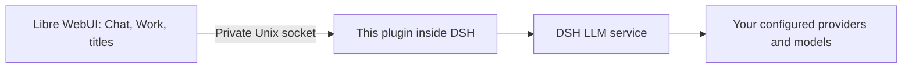
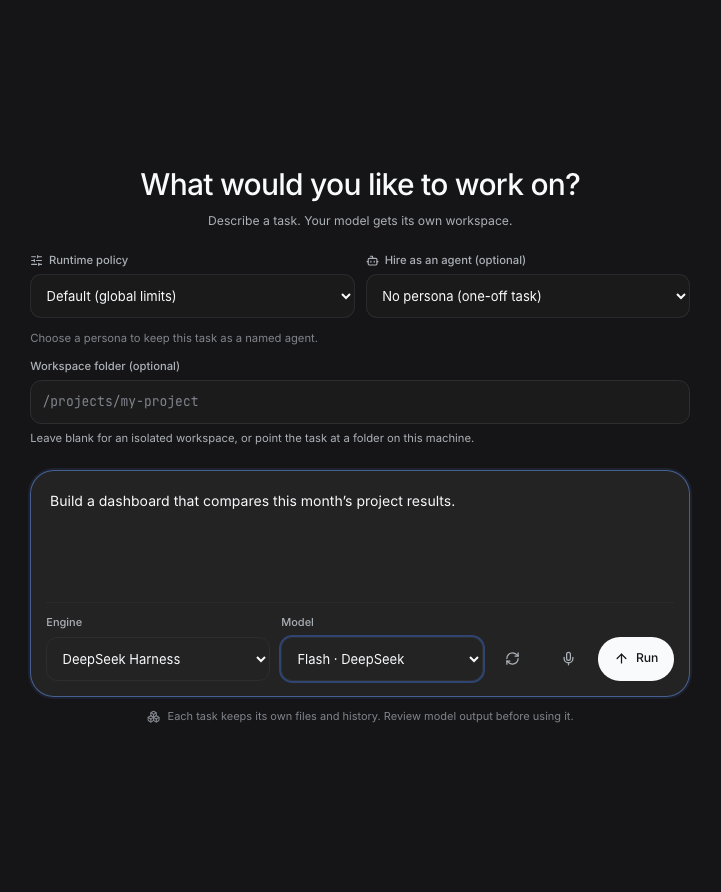

# DeepSeek Harness provider bridge for Libre WebUI

Use the models already configured in **DeepSeek Harness (DSH)** from
[Libre WebUI](https://github.com/libre-webui/libre-webui). Choose each native provider and model independently, including
Flash and Pro. Provider credentials stay in DSH.

This is the `@libre-webui/dsh-native-provider` plugin shown in DSH's Plugins
page. It connects the two applications through a private Unix socket. It adds
no web server, telemetry, agent sessions, or host tools.



Libre WebUI manages conversations, usage, and Work's sandbox. DSH supplies the
selected model connection. A Work task never gains access to DSH's native
agents, sessions, files, or tool execution through this plugin.



Work interface shown with demo data.

## Requirements

- macOS or Linux, with both applications running as the **same OS user**.
- Node.js **22.22 or later**, as required by the supported DSH installation.
- **pnpm** available to DSH's plugin manager. You do not need npm, a source
  checkout, or a compiler to install this plugin through DSH.
- A running DSH profile with at least one working provider. This package is
  tested against DSH **0.1.6-alpha.2** and Cordis **4.0.2**; DSH APIs are
  pre-stable, so other versions need compatibility testing.
- [Libre WebUI 0.37.0 or later](https://github.com/libre-webui/libre-webui/releases/tag/v0.37.0),
  which includes the native provider integration.

The Unix connection does not support Windows, remote DSH hosts, or a stock
Libre WebUI container connecting directly to a host socket. See
[configuration and deployment](docs/CONFIGURATION.md).

## Install

In **DSH → Plugins → Add plugin**, paste this into **Package name or address**:

```text
https://github.com/libre-webui/dsh-native-provider
```

Click **Install**. The repository includes the built plugin and its DSH bundle
patch. Installation requires no build commands or install-script approval.

Verify **native-provider 0.1.1** has a running component. DSH applies a fresh
installation to a live profile; follow a restart notice if DSH displays one.
DSH derives the short title from the package name; the full package identity
is `@libre-webui/dsh-native-provider`. Use the **GitHub URL**, because the bare
package name is not published on npm.

The default socket is `<DSH home>/lwui-provider/llm.sock`. Normally this means
`$HOME/.dsh/lwui-provider/llm.sock`; a configured `DSH_HOME` takes precedence.
DSH creates the private socket directory. See [configuration](docs/CONFIGURATION.md)
if you need a different path or have multiple DSH profiles.

The optional CLI equivalent is:

```bash
dsh plugin --profile web add https://github.com/libre-webui/dsh-native-provider
```

Use your actual profile name. Restart that profile after CLI installation.

## Connect Libre WebUI

Then configure Libre WebUI's `cordis.config.yml` with the **same absolute path**:

```yaml
nativeProvider:
  socketPath: /absolute/home/.dsh/lwui-provider/llm.sock
```

Replace `/absolute/home` with your home directory. YAML does not expand `$HOME`
or `~`. Alternatively, set `LIBRE_DSH_PROVIDER_SOCKET` when launching Libre
WebUI. Restart Libre WebUI after changing its startup configuration.

In Libre WebUI, enable **Cordis Engine** as an administrator:

1. **Work:** select **DeepSeek Harness**, then select a model from **Native DSH
   models**. Selecting a Libre WebUI model instead uses its existing LWUI
   provider connection.
2. **Chat:** also enable **Agent CLI models**, then use a native DSH model under
   **Agents**.
3. **Provider Usage:** inspect native requests under **DeepSeek Harness ·
   provider**. Only usage reported by the provider is shown; missing token
   counts are not estimated.

There is no default-model substitution: unavailable selections fail with an
error instead of silently switching provider.

## Upgrade an existing installation

For the old locally prepared **0.0.0/0.1.0** bundle, let active requests finish,
then use **Uninstall** on that plugin's page. Return to **Add plugin**, paste
the GitHub URL above, and click **Install**. This replaces the local-only source
with the public repository. Native DSH sessions and provider credentials are
not deleted. With the usual DSH home, the default socket matches the old guide;
retain a custom socket using the override in [configuration](docs/CONFIGURATION.md).

For subsequent CLI updates of the GitHub-installed plugin:

```bash
dsh plugin --profile web update @libre-webui/dsh-native-provider
```

Restart the profile and verify its version. To pin or roll back to a reviewed
revision, install `github:libre-webui/dsh-native-provider#<commit>` instead of
the moving default branch. A disabled installation remains disabled until enabled.

## Remove

```bash
dsh plugin --profile web remove @libre-webui/dsh-native-provider
```

Restart DSH and remove `nativeProvider.socketPath` or the corresponding
environment variable from Libre WebUI's configuration. An explicitly empty
`LIBRE_DSH_PROVIDER_SOCKET` disables the connection even when YAML defines it.
Saved Libre WebUI tasks remain; they require an available provider before
continuing. Removing this plugin does not delete native DSH sessions or keys.

## Documentation

- [Configuration, verification, and troubleshooting](docs/CONFIGURATION.md)
- [Security and privacy](SECURITY.md)
- [Development and upstream synchronization](CONTRIBUTING.md)
- [Libre WebUI integration guide](https://github.com/libre-webui/libre-webui/blob/main/docs/65-CORDIS_CONFIGURATION.md#connect-models-from-a-running-dsh-instance)

## Development

```bash
npm ci
npm run check
npm audit --audit-level=moderate
```

Tests run against local fixtures and temporary Unix sockets. They do not need
provider credentials or make real model calls. The generated bundle contains
only the compiled plugin, protocol, package metadata, patch, README, and license;
no npm runtime dependencies are installed into DSH.

The implementation is maintained with Libre WebUI's matching client and mirrored
here. `upstream.json` records the source revision and file hashes. The committed
`runtime/` files make public Git installation work without a compiler; CI checks
that they exactly match a fresh TypeScript build. See
[contributing](CONTRIBUTING.md) before changing the wire protocol.

Apache-2.0. Maintained by [Libre WebUI](https://github.com/libre-webui).
