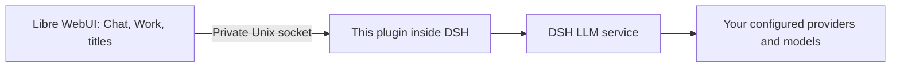

# DeepSeek Harness provider bridge for Libre WebUI

Use the models already configured in **DeepSeek Harness (DSH)** from
**Libre WebUI**. Choose each native provider and model independently, including
Flash and Pro. Provider credentials stay in DSH.

This is the `@libre-webui/dsh-native-provider` plugin shown in DSH's Plugins
page. It connects the two applications through a private Unix socket. It adds
no web server, telemetry, agent sessions, or host tools.



Libre WebUI manages conversations, usage, and Work's sandbox. DSH supplies the
selected model connection. A Work task never gains access to DSH's native
agents, sessions, files, or tool execution through this plugin.

## Requirements

- macOS or Linux, with both applications running as the **same OS user**.
- Node.js **22.22 or later** and npm to build the bundle.
- The DSH CLI and **pnpm** on your `PATH`. DSH uses pnpm to install bundles;
  npm is used to build this repository.
- A running DSH profile with at least one working provider. This package is
  tested against DSH **0.1.6-alpha.2** and Cordis **4.0.2**; DSH APIs are
  pre-stable, so other versions need compatibility testing.
- Libre WebUI with the native provider integration from
  [libre-webui/libre-webui#219](https://github.com/libre-webui/libre-webui/pull/219).
  Until that integration is released, use its `feat/cordis-bridge-lwui` branch.

The Unix connection does not support Windows, remote DSH hosts, or a stock
Libre WebUI container connecting directly to a host socket. See
[configuration and deployment](docs/CONFIGURATION.md).

## Install

This package is distributed from this repository; it is **not published to npm**.
Build it, then install the generated local bundle with DSH's plugin manager.

```bash
git clone https://github.com/libre-webui/dsh-native-provider.git
cd dsh-native-provider
npm ci
npm run build
npm run bundle -- "$HOME/.dsh/lwui-provider-v0.1.0" "$HOME/.dsh/lwui-provider/llm.sock"
dsh plugin --profile web add "$HOME/.dsh/lwui-provider-v0.1.0"
```

Use the profile that runs your DSH instance instead of `web` if different.
The bundle directory must be new. Its parent must already exist. Use absolute,
normalized paths; the complete socket path must fit within **100 UTF-8 bytes**.
DSH creates the private socket directory if necessary.

Restart that DSH profile using your usual launch method. In **Plugins**, verify
`native-provider` has version **0.1.0**, a description, and a running component.
DSH derives the short title from the package name; the full package identity
remains `@libre-webui/dsh-native-provider` so existing installations can upgrade.
An already disabled installation stays disabled until you enable it.

Then configure Libre WebUI's `cordis.config.yml` with the **same absolute path**:

```yaml
nativeProvider:
  socketPath: /absolute/home/.dsh/lwui-provider/llm.sock
```

Replace `/absolute/home` with your home directory. YAML does not expand `$HOME`
or `~`. Alternatively, set `LIBRE_DSH_PROVIDER_SOCKET` when launching Libre
WebUI. Restart Libre WebUI after changing its startup configuration.

In Libre WebUI, enable **Cordis Engine** as an administrator:

1. **Work:** select **DeepSeek Harness**, then select a model from **Native DSH
   models**. Selecting a Libre WebUI model instead uses its existing LWUI
   provider connection.
2. **Chat:** also enable **Agent CLI models**, then use a native DSH model under
   **Agents**.
3. **Provider Usage:** inspect native requests under **DeepSeek Harness ·
   provider**. Only usage reported by the provider is shown; missing token
   counts are not estimated.

There is no default-model substitution: unavailable selections fail with an
error instead of silently switching provider.

## Upgrade an existing installation

Let active requests finish before changing the installed bundle or restarting
DSH. Update this checkout, run `npm ci` and `npm run build`, then prepare a **new
bundle directory** and re-add it under the same package identity:

```bash
git pull --ff-only
npm ci
npm run build
npm run bundle -- "$HOME/.dsh/lwui-provider-updated" "$HOME/.dsh/lwui-provider/llm.sock"
dsh plugin --profile web add "$HOME/.dsh/lwui-provider-updated"
```

Restart the profile and verify the version in Plugins. Keep the previous bundle
until verification completes. To roll back, re-add its path and restart. For a
local source, `dsh plugin update` does not pull this Git repository for you.

## Remove

```bash
dsh plugin --profile web remove @libre-webui/dsh-native-provider
```

Restart DSH and remove `nativeProvider.socketPath` or the corresponding
environment variable from Libre WebUI's configuration. An explicitly empty
`LIBRE_DSH_PROVIDER_SOCKET` disables the connection even when YAML defines it.
Saved Libre WebUI tasks remain; they require an available provider before
continuing. Removing this plugin does not delete native DSH sessions or keys.

## Documentation

- [Configuration, verification, and troubleshooting](docs/CONFIGURATION.md)
- [Security and privacy](SECURITY.md)
- [Development and upstream synchronization](CONTRIBUTING.md)
- [Libre WebUI integration guide](https://github.com/libre-webui/libre-webui/blob/feat/cordis-bridge-lwui/docs/65-CORDIS_CONFIGURATION.md#connect-models-from-a-running-dsh-instance)

## Development

```bash
npm ci
npm run check
npm audit --audit-level=moderate
```

Tests run against local fixtures and temporary Unix sockets. They do not need
provider credentials or make real model calls. The generated bundle contains
only the compiled plugin, protocol, package metadata, patch, README, and license;
no npm runtime dependencies are installed into DSH.

The implementation is maintained with Libre WebUI's matching client and mirrored
here for independent installation. `upstream.json` records the source revision
and file hashes. See [contributing](CONTRIBUTING.md) before changing the wire
protocol.

Apache-2.0. Maintained by [Libre WebUI](https://github.com/libre-webui).
